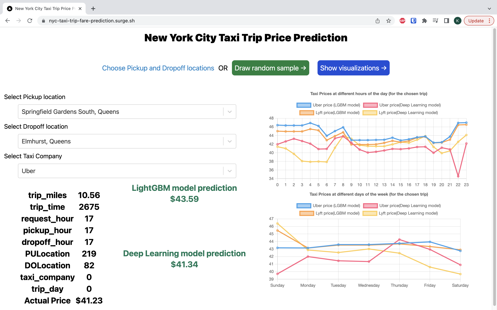

# Prediction of Taxi Trip fares and deployment of ML models

## Name: Venkata Krishna Bharadwaj Boinepally
## UB ID: 50419396
## UB Email: vboinepa@buffalo.edu
## Course: CSE 587: Data Intensive Computing
## Term: Fall 2022
## Project Name: [Phase 3] Web tool to predict Taxi fares given a Pickup and Dropoff location
-----
## Demo
- The live website is deployed on this website - https://nyc-taxi-trip-fare-prediction.surge.sh/
- You can go to this site and explore the complete working of Phase 3

## How to run
- If you prefer to get the code and run on your own, then follow these steps
1. `cd phase-3-web-tool`
2. `npm i`
3. `npm run dev`
4. Go to http://localhost:3000 and you will see the same exact website deployed [here](https://nyc-taxi-trip-fare-prediction.surge.sh/)

## About Phase 3 web tool product
- This tool is designed for taxi passengers to enter their pickup and dropoff locations and show the ML predicted price at this point of time
- It also shows the predicted fares over all hours throughout the day as a graph plotted over hour. This contains the predictions in 4 different cases and each taxi company
- Similarly, it also shows the predicted fares for the same time but during different days of the week.
- We can also randomly draw a sample from the test set and show the predicted fares and the visualizations of predictions for different times and days.
- This web tool is built on top of Phase 1 analysis and Phase 2 ML models trained on over 17 million records. So it is not practical for users to enter their own data/dataset. So I exported the ML models from Phase 2 and deployed them on Phase 3.
- However, the website is fast, the ML predictions happen on Client side and no server calls are made for doing prediction. This results in very fast, less than 1 second predictions and analysis.
- This is how the website looks in action

## About Phase 3 code and file structure
- Phase 3 web tool is built using Next js, React js, Tailwind CSS, ONNX and Google Maps API
- Next js is used for building static websites in React js.
- Tailwind CSS is used for styles
- ONNX is used for exporting the ML models (LightGBM and Tensorflow Keras model) built in Phase 2 to `.onnx` format. And using `onnx-runtime-web` to take the `.onnx` models and run predictions on the Client side. This results is fast predictions without any server attached (static website).
- Google Maps Distance Matrix API is used for getting distance and travel time between two locations.
- `./models/Phase3.ipnyb` is the utility python notebook. Some work and some helper functions are implemented and used in this notebook. This notebook also contains some code which is used to export pickle models to ONNX models.
- The exported LightGBM and Keras models from Python and ONNX are there in `./models` directory.

## About the models
- After the end of Phase 2, we have 2 models, `LightGBM` and `Keras Deep Learning` models which gave the best results. These models are exported to ONNX format (as is) and used on the client side for prediction
- Out of 5 models tried in Phase 2, LightGBM and Deep Learning models are used in this Phase 3.
- After exporting, the LightGBM model is 250 KB and Deep Learning model is 8 MB.
- For every parameter change, price predictions are recalculated. All of this happens less than 1 second including the visualizations. So for every parameter change (E.g., change pickup point), 2 predictions from each model and 124 predictions to get the visualizations data. So in total, 126 predictions are run in less than a second. If this happens on Server side, this will add lots of latency and inefficiency and can easily result in 10+ seconds for each input.
- All of these features, make it really easy to use the data product (web site).

## Usefulness, Recommendations and future improvements
- By looking at the data product (web tool), the users can know the predicted price between two locations.
- They can also know the distance between two locations, travel time and the estimated fare all in one place with very quick less than a second predictions.
- Users can see the prices without opening Uber or Lyft apps. Often times, Uber/Lyft hike prices when the users repeatedly check prices on their app.
- The predictions are done on Client side using ONNX which uses Web Assembly to run the models and predict. This results in very fast predictions which are hard to beat.
- Users can see the prices between two locations at different times of day and different days of the week. So they can plan their trips ahead and travel at cheaper prices.
- Similarly, Taxi drivers can use this tool and try taking trips at times with highest prices so they can increase their profits atleast 2x.
- Since I have used only one month data (July 2022), in future, we can include other months data and predict trends according to seasons (E.g., Snowy, Rainy, Sunny conditions)
- All the pricing data was sort of a black box with Uber and Lyft dictating the prices and slowly going to controlling them. This project will bring transparency in pricing and allows users to decide what is the fair pricing according to their judgement.
- In future, I am planning to incorporate more data and advanced metrics which are easy to use.
- The website is also mobile responsive so users can open on mobile and check the prices.
- In future, we can allow users to choose pickup and dropoff data on the map and show even more accurate predictions and analytics.
- This project will call for the much needed discussions regarding the prices charged by the taxi companies.
- I can also include a minimum cost of the trip metric based on the gas prices at that time, time and distance between two points and the gas mileage given by a car or an EV. This will help the Users, Taxi Drivers and Taxi companies see the margin earned by Drivers and Taxi companies and affordability of the Taxi trips for Users.

## References
- Microsoft ONNX - https://github.com/Microsoft/onnxruntime
- Next js, React js, Tailwind CSS, Google Maps Distance Matrix API